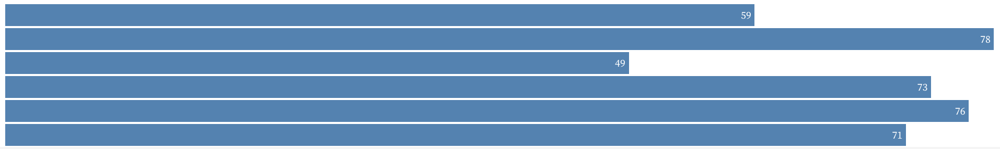
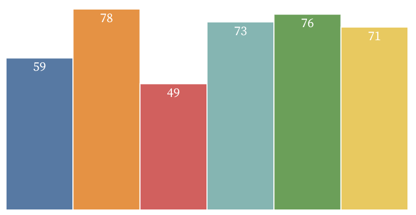

```js
import vega_datasets from 'npm:vega-datasets@2';

const randomColor = () => `#${Math.floor(Math.random()*16777215).toString(16)}`;

const { op } = aq;
```

# Introduction to D3, Part 1

_(Note: this is a revised version of an [original notebook by Arvind Satyanarayan](https://observablehq.com/@mitvis/introduction-to-d3). The current notebook includes modified text and code updated for D3 v6 and higher.)_

There are numerous methods for designing visualizations, including _visual analysis grammars_ like [Vega-Lite](https://vega.github.io/vega-lite) and _visualization grammars_ like [D3.js](https://d3js.org/).

Visual analysis grammars break visualization design down into a process of specifying _mappings_ (or _visual encodings_) between data fields and the properties of graphical objects called _marks_. Such grammars are useful for concisely and rapidly creating recognizable visualizations, while providing more design flexibility (or _expressivity_) than the chart typologies commonly found in spreadsheet tools.

However, describing visualization design in these high-level terms limits the types of visualizations we can create. For example, we can only use the available marks, and can only bind data to supported encoding channels.

For more expressive power, we must take one step down the [ladder of abstraction](http://worrydream.com/LadderOfAbstraction/): from _visual analysis_ grammars to more general-purpose _visualization_ grammars. With visualization grammars, we still specify how data values map to the properties of graphical marks, but we now have an additional set of operators to specify this mapping with more fine-grained control.

In this notebook, we will gain familiarity with one of the most widely used visualization grammars: [D3.js](https://d3js.org/). Let's start by importing the D3 library:

```js run=false
import * as d3 from 'd3';
```

Next let's load a dataset to work with. We'll use a dataset on global health and population measures from 1955–2005, compiled by the [Gapminder Foundation](https://www.gapminder.org/) and shared in [Hans Rosling's popular TED talk](https://www.youtube.com/watch?v=hVimVzgtD6w).

```js echo
const gapminder = vega_datasets['gapminder.json']()
```

```js
Inputs.table(gapminder)
```

<hr>

## Selections and Data Binding

Rather than confining us to a pre-determined set of graphical marks, D3 takes a much more general approach: _any element_ of the DOM (the [Document Object Model](https://developer.mozilla.org/en-US/docs/Web/API/Document_Object_Model/Introduction), or the programmatic representation of a webpage) can be a data-driven mark.

For instance, we could "visualize" a subset of our dataset as an ordered list (`<ol>`), where the list items (`<li>`) are marks:

```js
listData
```

```js echo
 // extract the 10 most populous countries in 2005
const listData = gapminder
  .filter(d => d.year === 2005)
  .sort((a, b) => b.pop - a.pop)
  .slice(0, 10)
```

```js
display(function() {
  const fmt = d3.format(',');
  const ol = d3.create('ol');

  ol.selectAll('li') // selects all 'li' elements (which may or may not exist!)
    .data(listData)  // provides the backing data
    .join('li')      // joins data with the selection, creating 'li' elements as needed
    .text(d => `${d.country}: ${fmt(d.pop)}`); // add formatted text to 'li' elements

  return ol.node();
}())
```
```js run=false
const fmt = d3.format(','); // number formatting helper
const ol = d3.create('ol'); // create a d3 selection containing a new 'ol' element

ol.selectAll('li') // select all 'li' elements under 'ol' (these may or may not exist!)
  .data(listData)  // provide the backing data for our desired list elements
  .join('li')      // join the data with the selection, creating 'li' elements as needed
  .text(d => `${d.country}: ${fmt(d.pop)}`); // add formatted text to 'li' elements

ol.node()
```

To enable this functionality, D3's core operator is the [_selection_](https://d3js.org/d3-selection). Selections specify a set of DOM elements that share the same tag name, class attribute, or any other supported [CSS Selector](https://www.w3schools.com/cssref/css_selectors.asp). Selections are specified with the [`d3.select`](https://d3js.org/d3-selection/selecting#select) and [`d3.selectAll`](https://d3js.org/d3-selection/selecting#selectAll) functions, which roughly map to their native DOM equivalents ([`document.querySelector`](https://developer.mozilla.org/en-US/docs/Web/API/Document/querySelector) and [`document.querySelectorAll`](https://developer.mozilla.org/en-US/docs/Web/API/Document/querySelectorAll)).

Using our selection as the base, we can employ the [`selection.data()`](https://d3js.org/d3-selection/joining#selection_data) operator to bind DOM elements to some backing data. We can then display the DOM node for the ordered list using `ol.node()`.

```js
display(function() {
  const ol = d3.create('ol');

  ol.selectAll('li') // select all list elements (orange circle below)
    .data(listData); // bind all our data values (blue circle below)

  return ol.node(); // extract the DOM element node of the 'ol' element
}())
```
```js run=false
const ol = d3.create('ol');

ol.selectAll('li') // select all list elements (orange circle below)
  .data(listData); // bind all our data values (blue circle below)

ol.node(); // extract the DOM element node of the 'ol' element
```

However, notice that the visualization above is blank! We have not yet created the new DOM elements for the list items. Rather, the call to `selection.data()` returns a _new_ selection with three different states: _enter_, _update_, and _exit_.

```js
selection
```

```js echo
const selection = d3.create('ol').selectAll('li').data(listData);
```

<svg width="720" height="240">
  <g transform="translate(0,128)">
    <g transform="translate(115)">
      <circle r="110" style="fill: rgba(49, 130, 189, 0.2); stroke: black;"></circle>
      <text y="-120" dy=".35em" text-anchor="middle" style="font-weight: bold;">Data</text>
      <text x="-50" dy=".35em" text-anchor="middle">Enter</text>
    </g>
    <text x="175" dy=".35em" text-anchor="middle">Update</text>
    <g transform="translate(235)">
      <circle r="110" style="fill: rgba(230, 85, 13, 0.2); stroke: black"></circle>
      <text y="-120" dy=".35em" text-anchor="middle" style="font-weight: bold;">Elements</text>
      <text x="50" dy=".35em" text-anchor="middle">Exit</text>
    </g>
  </g>
</svg>

<small>_Credit: [Mike Bostock](https://bost.ocks.org/mike/join/)_</small>

For every value in our backing data, the operator checks whether a corresponding DOM element exists in a one-to-one manner:

  * The **enter** state is a selection that contains _placeholders_ for every data value that did not have a corresponding element in the original selection.

  * The **update** state is a selection that contains _existing_ elements that match a bound data value.

  * The **exit** state is a selection that also contains _existing_ elements, but for which a matching data value was not found.

We can address the three states separately, but the [`selection.join()`](https://d3js.org/d3-selection/joining#selection_join) operator gives us a more convenient interface:

```js
display(function() {
  const ol = d3.create('ol');

  ol.selectAll('li') // select all list elements (orange circle above)
    .data(listData)  // bind all our data values (blue circle above)
    .join('li') ;    // merge the 'enter' and 'update' sets, create 'li' elements as needed

  return ol.node();  // return the DOM element node of the 'ol' element
}())
```
```js run=false
const ol = d3.create('ol');

ol.selectAll('li') // select all list elements (orange circle above)
  .data(listData)  // bind all our data values (blue circle above)
  .join('li');     // merge the 'enter' and 'update' sets, create 'li' elements as needed

ol.node();  // return the DOM element node of the 'ol' element
```

By default, if we just pass a string to `selection.join()`, entering elements are appended to the selection, exiting elements are removed, and updating elements simply pass through. However, we can also address the three states separately. For instance, the code snippet below is the long form version of the one above:

```js
vis
```

```js
const vis = (function() {
  const ol = d3.create('ol');

  ol.selectAll('li') // select all list elements (orange circle above)
    .data(listData)  // bind all our data values (blue circle above)
    .join(
      enter  => enter.append('li'), // <-- append an li element for each entering item
      update => update,             // <-- do nothing with items that match an existing element
      exit   => exit.remove()       // <-- remove li elements whose backing data is now gone
    );

  return ol.node(); // return the DOM element node of the 'ol' element
})();
```
```js run=false
const ol = d3.create('ol');

ol.selectAll('li') // select all list elements (orange circle above)
  .data(listData)  // bind all our data values (blue circle above)
  .join(
    enter  => enter.append('li'), // <-- append an li element for each entering item
    update => update,             // <-- do nothing with items that match an existing element
    exit   => exit.remove()       // <-- remove li elements whose backing data is now gone
  );

ol.node(); // return the DOM element node of the 'ol' element
```

We now have a new list item element for each element in our dataset, but we have yet to specify the content and visual style of the elements themselves. An advantage of D3 is that we can manipulate a selection _declaratively_. This means that rather than iterating over every item returned by the selector (like we would have had to do using `document.querySelectorAll`), we can operate on the selection as a whole:

```js
display(function() {
  const ol = d3.create('ol');

  ol.selectAll('li') // select all list elements (orange circle above)
    .data(listData)  // bind all our data values (blue circle above)
    .join('li')      // merge the 'enter' and 'update' sets, create 'li' elements as needed
      .attr('class', 'country')            // <-- set CSS class to 'country'
      .text(d => `${d.country}: ${d.pop}`) // <-- add text to 'li' elements

  return ol.node(); // return the DOM element node of the 'ol' element
}())
```
```js run=false
const ol = d3.create('ol');

ol.selectAll('li') // select all list elements (orange circle above)
  .data(listData)  // bind all our data values (blue circle above)
  .join('li')      // merge the 'enter' and 'update' sets, create 'li' elements as needed
    .attr('class', 'country')             // <-- set CSS class to 'country'
    .text(d => `${d.country}: ${d.pop}`); // <-- add text to 'li' elements

ol.node(); // return the DOM element node of the 'ol' element
```

Using selections, you can update the style even of elements that have already been created. For example, we can select the new list items with the CSS class `'country'` to update the style of our previous list:

```js echo
// Call this function to recolor just the first item in the list above
function recolorOne() {
  d3.select('li.country').style('color', randomColor());
}
```

```js
d3.create('button')
  .text('Call recolorOne()')
  .on('click', recolorOne)
  .node()
```

```js echo
// Call this function to recolor ALL items in the list above
// Sets all items to the same randomly selected color
function recolorAll() {
  d3.selectAll('li.country').style('color', randomColor());
}
```

```js
d3.create('button')
  .text('Call recolorAll()')
  .on('click', recolorAll)
  .node()
```

For the enter / update / exit cycle, matches are determined by the second argument to `.data()`, which specifies a key function. If no key function is specified, D3 conducts a join-by-index: the first data value is joined to the first DOM element, the second value to the second element, and so on. In the code for the exercise below, we instead join the data based on the country attribute.

<hr>

<span style="font-weight: bold; color: chocolate;">Exercise: Modify the _enter_, _update_, and _exit_ functions in the code below such that entering items are colored green, updating items are colored blue, and exiting items are _not_ removed but rather colored red</span>.

You can use the sliders below to change the elements in the backing `listData` to test your changes to `enter`, `update`, and `exit`.

```js
// min to max years in 5 year increments
const year = view(Inputs.range(
  d3.extent(gapminder, d => d.year),
  {
    label: 'year',
    step: 5,
    value: listData[0].year // initial year of listData elements
  }
))
```

```js
const n = view(Inputs.range(
  [0, 14],
  {
    step: 1,
    label: 'n',
    initial: listData.length
  }
))
```

```js
createList()
```

```js echo
function createList() {
  const ol = d3.select(html`<ol id="enter-update-exit"></ol>`);

  ol.selectAll('li')   // select all list elements (orange circle above)
    .data(listData)    // bind all our data values (blue circle above)
    .join('li')        // a selection that merges the "enter" and "update" states
      .text(d => `${d.country}: ${d.pop}`)

  return ol.node();
};
```

```js echo
// use a new dataset, manipulable with the variables defined above
const newData = gapminder
  .filter(d => d.year === year)
  .sort((a, b) => b.pop - a.pop)
  .slice(0, n);
```

```js echo
d3.select('ol#enter-update-exit')
  .selectAll('li')               // select all list elements
  .data(newData, d => d.country) // bind our data values; what happens when we remove the key function?
  .join(
    enter  => enter.append('li'),
    update => update,
    exit   => exit.remove()
  )
  .text(d => `${d.country}: ${d.pop}`);
```

<hr>

Why all of this complexity? D3's data join operators give us a general way to draw our visualization's marks. As a result, we don't have to worry about any kind of iteration or branching (i.e., no `for` loops or `if` statements). We can focus on _what_ we want our visualization to look like, rather than writing out each step for _how_ it should be computed. This property is called _declarative_ (in contrast to _imperative_) specification or programming and helps keep our code more readable and understandable. And, as we'll see in [Part 2](introduction-part-2) of this introduction, D3's data join makes it more convenient to specify animated transitions as items are entering, updating, or exiting.

<hr>

## A Simple Bar Chart

Before we get more complex, let's try our hand at making a simple bar chart showing the average life expectancy (`value`) for different geographic regions (`key`), using D3 to create basic HTML `<div>` elements.

<span style="font-weight: bold; color: chocolate;">Try to recreate the bar chart below. You will want to bind the bar data to new `div` elements, style them appropriately, and add the text. One thing to keep in mind: How might you increase the size of the bars to fill the width of the screen?</span>

The current page `width` = ${width} px.



```js
barData
```

```js echo
// compute average life expectancy per region ('cluster')
// output values as 'key' (cluster) and 'value' (life_expect)
const barData = aq.from(gapminder)
  .filter(d => d.year === 2005)
  .groupby('cluster')
  .rollup({ mean: d => op.floor(op.mean(d.life_expect)) })
  .orderby('cluster')
  .select({ cluster: 'key', mean: 'value' })
  .objects()
```

```js echo
display(function() {
  const data = barData;
  const container = d3.create('div');
  const barChart = container.selectAll('div')
    /* TODO: Add code here to generate the bar chart within the container. */

  barChart
    .style('background', 'steelblue')   // Set the background color of the div to 'steelblue'
    .style('border', '1px solid white') // Set the border of the div as 'white'
    .style('font-size', 'small')        // Set the text font size in the div to 'small'
    .style('color', 'white')            // Set the text font color to 'white'
    .style('text-align', 'right')       // Set the text alignment in the div to 'right'
    .style('padding', '3px')            // HINT: CSS styles require units, not just numbers
    /* TODO: Add code here to finish updating the visual properties of the bars */

  return container.node();
}())
```

Did you find yourself "hard-wiring" a scale factor for the width of the bars? If so, our simple bar chart exposes one weakness in how we might specify visual encodings: The _width_ of our bars could be dependent on a <a href="https://en.wikipedia.org/wiki/Magic_number_(programming)#Unnamed_numerical_constants">magic number</a>, which scales the data value to a pixel width. Ideally such scaling should not be brittle, it should adapt to the range of data values as well as the desired total width of the chart.

<hr>

## Scale Functions

Rather than implicitly dealing with scaling issues, or introducing maintenance and readability costs associated with magic numbers, D3 offers us a variety of [scale functions](https://d3js.org/d3-scale) to automatically map a _domain_ of data values to a _range_ of pixel values.

For instance, we can use the following scale to determine the width of our bars:

```js echo
const xscale = d3.scaleLinear()
  .domain([0, d3.max(barData, d => d.value)])
  .range([0, width]) // Observable's built-in width property!
```

`xscale` is a function that linearly maps an input value to the given range:

```js echo
xscale(49)
```

We can now use it to scale our bar widths like so:

```js echo
display(function() {
  const container = d3.create('div');

  container.selectAll('div')
    .data(barData)
    .join('div')
      .style('background', 'steelblue')
      .style('border', '1px solid white')
      .style('font-size', 'small')
      .style('color', 'white')
      .style('text-align', 'right')
      .style('padding', '3px')
      .style('width', d => `${xscale(d.value)}px`) // <-- Use xscale instead of a magic number
      .text(d => d.value);

  return container.node();
}());
```

Scales are a workhorse of visualization design! For example, we might want to assign each bar a different color. One option to do so could involve a large ternary expression or if-else statement. We can instead use a [color scale](https://d3js.org/d3-scale-chromatic) like so:

```js echo
const color = d3.scaleOrdinal(d3.schemeTableau10).domain(barData.map(d => d.key));
// Default color schemes are here: https://d3js.org/d3-scale-chromatic/categorical
// Try another one! For example: d3.schemePurples[6] or d3.schemePaired
```

```js echo
display(function() {
  const container = d3.create('div');

  container.selectAll('div')
    .data(barData)
    .join('div')
      .style('background', d => color(d.key)) // <-- Use color scale to specify the bar color
      .style('border', '1px solid white')
      .style('font-size', 'small')
      .style('color', 'white')
      .style('text-align', 'right')
      .style('padding', '3px')
      .style('width', d => `${xscale(d.value)}px`)
      .text(d => d.value);

  return container.node();
}());
```

<hr>

## SVG: Scalable Vector Graphics

At this point, we're nearing the limit of what we can do with D3 and the HTML DOM. In particular, HTML is largely restricted to rectangular shapes and is governed by a [complex layout model](https://developer.mozilla.org/en-US/docs/Learn/CSS/Building_blocks/The_box_model) that can often interfere with the way we wish to position and size marks for visualization purposes. In the previous chart, we relied entirely on the underlying layout model to position the bars instead of using a data-driven approach. This method breaks our _visual encoding_ abstraction of mapping data values to visual properties. In this case, each element is positioned based on the order in which it was created rather than a data value, and thus yields a more difficult and brittle design process.

Now imagine we want to rotate our bar chart into a column chart (i.e., tall bars instead of long ones): we would need to use an [inline](https://www.w3schools.com/css/css_inline-block.asp) [layout](https://www.w3schools.com/css/css_float.asp) [mechanism](https://css-tricks.com/snippets/css/a-guide-to-flexbox/) to position bars side-by-side rather than as stacked elements. As with the example above, this approach similarly lacks a connection to the relevant data properties.

As a result, rather than persevere with HTML, let's instead switch to [SVG (Scalable Vector Graphics)](https://developer.mozilla.org/en-US/docs/Web/SVG). SVG gives us a much richer set of [graphical primitives](https://developer.mozilla.org/en-US/docs/Web/SVG/Element) to work with including curves, lines, and arbitrary shapes. Like HTML, SVG elements can be styled using CSS and can be programmatically manipulated via the DOM. So everything we've learned so far in this notebook still applies.

Let's recreate our bar chart, this time using SVG `<rect>` elements:

```js echo
display(function() {
  const barHeight = 25;
  const height = barData.length * barHeight;

  // create svg element, specify total width and height
  const container = d3.create('svg')
    .attr('width', width)
    .attr('height', height);

  // add SVG 'rect' elements for bars
  container.selectAll('rect')
    .data(barData)
    .join('rect')
      .attr('x', 0)
      .attr('y', (d, i) => i * barHeight)
      .attr('width', d => xscale(d.value))
      .attr('height', barHeight)
      .style('fill', d => color(d.key))
      .style('stroke', 'white');

  // add SVG 'text' elements for labels
  container.selectAll('text')
    .data(barData)
    .join('text')
      .attr('x', d => xscale(d.value))
      .attr('y', (d, i) => i * barHeight)
      .attr('dx', -20)
      .attr('dy', '1.25em')
      .attr('fill', 'white')
      .style('font-size', 'small')
      .text(d => d.value);

  // return SVG DOM element
  return container.node();
}());
```

Perhaps the biggest change in our shift from HTML to SVG is that we are entirely responsible for how our bars are laid out. Whereas before we could rely on `<div>` elements gaining a height based on their content and padding, and on the [flow layout model](https://developer.mozilla.org/en-US/docs/Web/CSS/CSS_Flow_Layout) to position them one after another, in SVG we have to explicitly set the `x`, `y` positions of all elements, and the `width` and `height` of our `<rect>` elements.

<span style="font-weight: bold; color: chocolate;">A _magic number_ has snuck back into our specification. Can you spot it?</span>

Using SVG does not mean we need to hard-wire the height of our bars. Instead, we can use [band scales](https://observablehq.com/@d3/d3-scaleband) to automatically divide up the total height of our SVG element (`150px`) into equally-sized bars.

```js echo
const height = 150;
```

```js echo
const yscale = d3.scaleBand()
  .domain(barData.map(d => d.key))
  .range([0, height]); // Try flipping this to [height, 0] and see the effect on the bars below.
```

Now we can use our new `yscale` like so:

```js echo
display(function() {
  const container = d3.create('svg')
    .attr('width', width)
    .attr('height', height);

  container.selectAll('rect')
    .data(barData)
    .join('rect')
      .attr('x', 0)
      .attr('y', d => yscale(d.key))       // <-- Use yscale instead of manually positioning bars
      .attr('width', d => xscale(d.value))
      .attr('height', yscale.bandwidth())  // <-- Band scales split a pixel range into equal-sized bands
      .style('fill', d => color(d.key))
      .style('stroke', 'white');

  container.selectAll('text')
    .data(barData)
    .join('text')
      .attr('x', d => xscale(d.value))
      .attr('y', d => yscale(d.key))       // <-- Use yscale instead of manually positioning labels
      .attr('dx', -20)
      .attr('dy', '1.2em')
      .attr('fill', 'white')
      .style('font-size', 'small')
      .text(d => d.value);

  return container.node();
}());
```

With SVG, rotating our bar chart into a column chart becomes much more straightforward than it would have been with HTML.



<span style="font-weight: bold; color: chocolate;">Edit the code below to change your bar chart from a horizontal orientation to a vertical orientation (as in the image above). _Hint: Think about how the scales of a horizontal bar chart differ from those of a vertical bar chart._</span>

```js echo
display(function() {
  const width = 400;
  const height = 200;

  const container = d3.create('svg')
    .attr('width', width)
    .attr('height', height);

  // Update the x scale here.
  const xscale = d3.scaleLinear()
      .domain([0, d3.max(barData, d => d.value)])
      .range([0, width]);

  // Update the y scale here.
  const yscale = d3.scaleBand()
      .domain(barData.map(d => d.key))
      .range([0, height]);

  container.selectAll('rect')
    .data(barData)
    .join('rect')
      .attr('x', 0)                        // Update the x position
      .attr('y', d => yscale(d.key))       // Update the y position
      .attr('width', d => xscale(d.value)) // Update the width
      .attr('height', yscale.bandwidth())  // Update the height
      .style('fill', d => color(d.key))
      .style('stroke', 'white');

  container.selectAll('text')
    .data(barData)
    .join('text')
      .attr('x', d => xscale(d.value))     // Update the x position
      .attr('y', d => yscale(d.key))       // Update the y position
      .attr('dx', -20)                     // Update the x offset
      .attr('dy', '1.5em')                 // Update the y offset
      .attr('fill', 'white')
      .style('font-size', 'small')
      .style('text-anchor', 'middle')
      .text(d => d.value);

  return container.node();
}());
```

As you work through this example, you might find that while updating the orientation is more straightforward with this approach, properly positioning the bars remains challenging. Your first attempt may result in a chart like the following:


This outcome is because the origin `(0, 0)` of the SVG coordinate system is in the top-left hand corner of the SVG element. Because of this idiosyncrasy, our values are mapped such that the top of the chart corresponds to zero and values increase as you move downward. To address this mismatch from our expectations, we can update the definition of our scales:

```js echo
const yscaleFixed = d3.scaleLinear()
  .domain([0, d3.max(barData, d => d.value)])
  .range([height, 0]);
```

With this new definition, the zero point of the SVG coordinate system is mapped to the largest value in our dataset, whereas zero corresponds to our expected baseline: the height of the chart. <span style="font-weight: bold; color: chocolate;">Using the new scale, try updating your bar chart to match the original image. _Hint: The y position is the position for the top of the bars!_</span>

As we can see, scales really are at the heart of our visualization design process. As a result, it's often very helpful to visualize the scales themselves as axes and legends. D3 can help with this, but we first have to take a bit of a tangent...

<hr>

## `<g>`: The SVG Group Element

SVG's `<g>` element allows us to group a set of elements together, not unlike desktop presentation packages like Keynote or Powerpoint. Once grouped, all children can be transformed together — for example, we can position the overall group rather than the individual children. Each `<g>` also establishes its own coordinate system, with the origin `(0, 0`) in the top-left hand corner.

For example, we can rewrite our bar chart visualization using `<g>` elements as follows. Notice that the `<rect>` and `<text>` elements are now children of `<g>`, inherit its data, and only need minimal positioning due to the group's `transform`.

```js echo
display(function() {
  const container = d3.create('svg')
    .attr('width', width)
    .attr('height', height);

  const g = container.selectAll('g')
    .data(barData)
    .enter() // <-- We use "enter" (not "join") so we can later append <rect> and <text> only for new data.
      .append('g')
        .attr('transform', d => `translate(0, ${yscale(d.key)})`);

  g.append('rect')
      // We no longer need to bind data to <rect>, or specify y positions.
      .attr('width', d => xscale(d.value))
      .attr('height', yscale.bandwidth())
      .style('fill', d => color(d.key))
      .style('stroke', 'white');

  g.append('text')
      // We no longer need to bind data to <text>, or specify y positions.
      .attr('x', d => xscale(d.value))
      .attr('dx', -20)
      .attr('dy', '1.2em')
      .attr('fill', 'white')
      .style('font-size', 'small')
      .text(d => d.value);

  return container.node();
}());
```

Alright, now that we've met `<g>`, let's get back to the main event!

<hr>

## Visualizing Scales: Axes & Legends

Axes and legends visualize our scale functions using text labels, shapes, and lines. We could construct them manually (as in [this notebook](https://observablehq.com/@d3/color-legend)) but D3 (and its developer community) offers us some helper modules to make our lives easier.

Let's start with axes. With the way we're currently drawing our bar chart, we haven't left any room for axes — the bars are flush with the left and bottom sides of our SVG container. To give us the space we need, we use the [margin convention](https://observablehq.com/@d3/margin-convention):

```js
graphic
```

<small>_Credit: [Mike Bostock](https://observablehq.com/@d3/margin-convention)_</small>

Rather than only defining the `width` and `height` of our visualization, and using these variables to drive the ranges of our `x` and `y` scales, we will define an additional `margin` object with a property for each of the four sides:

```js echo
const margin = {top: 10, right: 10, bottom: 20, left: 20};
```

Our scales will then use this margin offset to determine their range:

```js echo
// Domain (data values): [0, 78], Range (pixel values): [20, width - 10]
const xMargin = xscale.copy().range([margin.left, width - margin.right]);
```

```js echo
// Remember (0, 0) is the top-left hand corner; try flipping the elements and see what happens!
// Domain (data values): [0, 1, 2, 3, 4, 5], Range (pixel values): [height - 20, 10]
const yMargin = yscale.copy().range([height - margin.bottom, margin.top]);
```

Using these scales, our bar chart currently looks like this. We now have some whitespace around the left and bottom of the SVG element, just waiting for our axes!

You may also notice that the order of our bars has switched from previous examples to account for the SVG coordinate system; the blue bar (where `key` is 0) is now positioned at the expected zero point of our future axis.

```js echo
display(function () {
  const container = d3.create('svg')
    .attr('width', width)
    .attr('height', height)
    .style('border', '1px dotted #999'); // <-- A dotted border helps us see the added margin

  const g = container.selectAll('g')
    .data(barData)
    .enter()
      .append('g')
        .attr('transform', d => `translate(${margin.left}, ${yMargin(d.key)})`);

  g.append('rect')
      .attr('width', d => xMargin(d.value) - xMargin(0)) // <-- We must subtract our left offset.
      .attr('height', yMargin.bandwidth())
      .style('fill', d => color(d.key))
      .style('stroke', 'white');

  g.append('text')
      .attr('x', d => xMargin(d.value) - xMargin(0))    // <-- We must subtract our left offset.
      .attr('dx', -20)
      .attr('dy', '1em')
      .attr('fill', 'white')
      .style('font-size', 'small')
      .text(d => d.value);

  return container.node();
}());
```

The [d3-axis](https://github.com/d3/d3-axis) module offers a variety of helper functions to draw our axes, and customize their display (e.g., how many ticks are shown, what are their values, _etc._). An axis helper is meant to be called to populate a `<g>` element. Also note how we apply a `translate` transformation to position the axes along the edges of the SVG element, offset by our margin.

```js echo
display(function() {
  const container = d3.create('svg')
    .attr('width', width)
    .attr('height', height)
    .style('border', '1px dotted #999');

  container.append('g')
    .attr('transform', `translate(0, ${height - margin.bottom})`)
    .call(d3.axisBottom(xMargin));

  container.append('g')
    .attr('transform', `translate(${margin.left}, 0)`)
    .call(d3.axisLeft(yMargin));

  return container.node();
}());
```

Our last step is then to merge all our code together, bars + axes:

```js echo
display(function() {
  const container = d3.create('svg')
    .attr('width', width)
    .attr('height', height);

  const g = container.selectAll('g')
    .data(barData)
    .enter()
      .append('g')
        .attr('transform', d => `translate(${margin.left}, ${yMargin(d.key)})`);

  g.append('rect')
      .attr('width', d => xMargin(d.value) - xMargin(0))
      .attr('height', yMargin.bandwidth())
      .style('fill', d => color(d.key))
      .style('stroke', 'white');

  g.append('text')
      .attr('x', d => xMargin(d.value) - xMargin(0))
      .attr('dx', -20)
      .attr('dy', '1em')
      .attr('fill', 'white')
      .style('font-size', 'small')
      .text(d => d.value);

  container.append('g')
    .attr('transform', `translate(0, ${height - margin.bottom})`)
    .call(d3.axisBottom(xMargin));

  container.append('g')
    .attr('transform', `translate(${margin.left}, 0)`)
    .call(d3.axisLeft(yMargin));

  return container.node();
}());
```

Unfortunately, D3 does not offer a built-in mechanism for creating legends, but we will see how to create our own when we build an interactive legend in [Part 2](https://observablehq.com/@uwdata/introduction-to-d3-part-2)!

<hr>

## Summary

After working with Vega-Lite and moving to D3, you might be thinking: "What a lot of low-level work for such a simple chart!" _(You would not be wrong!)_ However, the example above introduces most of the components you will need to construct a variety of more complex visualizations. The concepts &amp; utilities you've learned will become second nature as you start to build more ambitious charts!

Borrowing from [Scott Murray](https://alignedleft.com/work/d3-book-2e), D3 is _not_ a charting library. Rather, it is more apt to call it a visualization _kernel_ as it offers a series of modules for constructing visualizations including [loading](https://github.com/d3/d3-fetch) and [parsing](https://github.com/d3/d3-dsv) data, [binding](https://github.com/d3/d3-selection) and [encoding](https://github.com/d3/d3-scale) DOM elements, and calculating more advanced layouts such as [force-directed layouts](https://github.com/d3/d3-force) or [cartographic projections](https://github.com/d3/d3-geo).

This notebook only scratches the surface of all the functionality D3 provides. Luckily, as D3 is one of the most widely used JavaScript libraries, there is a rich and diverse set of examples to learn from. We recommend perusing the [@d3 Observable notebooks](https://observablehq.com/@d3) or looking through the [curated gallery of examples](https://observablehq.com/@d3/gallery).

When you're ready for more&mdash;including animation & interaction&mdash;[move on to Part 2](introduction-part-2)!

<hr>

### Acknowledgements

This notebook is a revised version of Arvind Satyanarayan's [Introduction to D3](https://observablehq.com/@mitvis/introduction-to-d3), which in turn was heavily inspired by Mike Bostock's [Let's Make a Bar Chart](https://bost.ocks.org/mike/bar/) series. Jane Hoffswell made major contributions to this revision.

```js
const graphic = (function() {
  const barId = 'margin-bar';
  const arrowId = 'margin-arrow';
  const margin = {top: 20, right: 30, bottom: 30, left: 40};
  const height = 500;
  const x = d3.scaleLinear()
    .domain([0, 1])
    .range([margin.left, width - margin.right]);
  const y = d3.scaleLinear()
    .domain([0, 1])
    .range([height - margin.bottom, margin.top]);
  const xAxis = g => g
    .attr("transform", `translate(0,${height - margin.bottom})`)
    .call(d3.axisBottom(x));
  const yAxis = g => g
    .attr("transform", `translate(${margin.left},0)`)
    .call(d3.axisLeft(y));

  return svg`<svg viewBox="0 0 ${width} ${height}" style="max-width: ${width}px; font: 10px sans-serif; overflow: visible;">
  <defs>
    <marker id="${barId.id}" viewBox="-5 -5 10 10" markerWidth="6" markerHeight="6" orient="auto">
      <path fill="none" stroke="black" stroke-width="1.5" d="M0,5v-10"></path>
    </marker>
    <marker id="${arrowId.id}" viewBox="0 0 10 10" refX="10" refY="5" markerWidth="6" markerHeight="6" orient="auto">
      <path d="M0,0L10,5L0,10z"></path>
    </marker>
  </defs>
  <rect fill="none" stroke="#000" stroke-dasharray="1,2" width="${width}" height="${height}"></rect>
  <rect fill="#eee" stroke="#ccc" x="${margin.left}" y="${margin.top}" width="${width - margin.left - margin.right}" height="${height - margin.top - margin.bottom}"></rect>

  <g fill="none" stroke="#000" marker-start="${barId}" marker-end="${arrowId}">
    <path d="M0,${height / 2}h${margin.left}"></path>
    <path d="M${width},${height / 2}h${-margin.right}"></path>
    <path d="M${width / 2},0v${margin.top}"></path>
    <path d="M${width / 2},${height}v${-margin.bottom}"></path>
  </g>

  <circle r="2.5"></circle>

  <text x="${margin.left + 6}" y="${height / 2}" dy="0.35em">margin.left</text>
  <text x="${width - margin.right - 6}" y="${height / 2}" dy="0.35em" text-anchor="end">margin.right</text>
  <text x="${width / 2}" y="${margin.top + 6}" dy="0.71em" text-anchor="middle">margin.top</text>
  <text x="${width / 2}" y="${height - margin.bottom - 6}" text-anchor="middle">margin.bottom</text>
  <text x="6" dy="0.35em" fill="none" stroke="white" stroke-linejoin="round" stroke-width="4">origin</text>
  <text x="6" dy="0.35em">origin</text>

  ${d3.create("svg:g").call(xAxis).node()}
  ${d3.create("svg:g").call(yAxis).node()}
</svg>`;
}());
```
