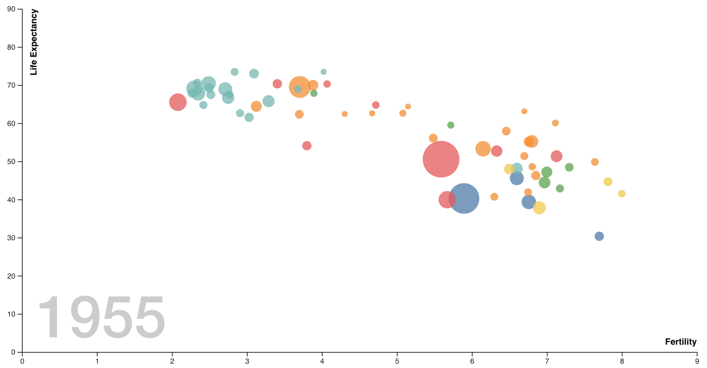

```js
import vega_datasets from 'npm:vega-datasets@2';
```

# Introduction to D3, Part 2

In [Introduction to D3, Part 1](introduction-part-1), we learned the basics of D3 for creating and transforming both HTML and SVG. Now we will put those skills to work and build interactive graphics that animate changes over time. We'll continue to use the [Gapminder Foundation](https://www.gapminder.org/) dataset on global health and population measures, recreating the "bubble plot" made famous in [Hans Rosling's TED presentation](https://www.youtube.com/watch?v=hVimVzgtD6w).

Let's import D3, load and preview our dataset, and then get going!


```js echo
const gapminder = vega_datasets['gapminder.json']()
```

```js
Inputs.table(gapminder)
```

<hr>

## Build the Base Plot

We'll begin by creating a static scatter plot for a single year. For this phase, we will put into practice most of what we learned in [Introduction to D3, Part 1](introduction-part-1).

Here is a static image of the chart we want to create:



As preliminary steps, we'll compute the minimum and maximum years in the data (using the `d3.extent` helper), and filter our dataset to the initial year:

```js
years
```

```js echo
const years = d3.extent(gapminder, d => d.year)
```

```js
dataInitial
```

```js echo
const dataInitial = gapminder.filter(d => d.year === years[0])
```

Next, let's set up the basic dimensions of our chart. For the width, we will use the built-in `width` variable provided by Observable (though you should feel free to override this if you want to). We will also set our desired `height`, plus a `margin` object with space to accommodate *x* and *y* axes.

```js
const height = 500;
```

```js
const margin = ({top: 10, right: 10, bottom: 20, left: 20});
```

Our envisioned design is a scatter plot of countries (circles) that we:

- Position along the x-axis by the number of children per mother (`fertility`)
- Position along the y-axis by the life expectancy in years (`life_expect`)
- Color by geographic region (coded by the `cluster` field)
- Size by their population (`pop`)

For each of these attributes, we need a corresponding [_scale_](https://medium.com/@mbostock/introducing-d3-scale-61980c51545f) to map from data values to visual values. For the x and y axes we can use standard linear scales, ensure a zero baseline, and include `margin` offsets in the scale range to ensure appropriate sizing.

```js echo
const x = d3.scaleLinear()
  .domain([0, d3.max(gapminder, d => d.fertility)])
  .range([margin.left, width - margin.right])
  .nice();
```

```js echo
const y = d3.scaleLinear()
  .domain([0, d3.max(gapminder, d => d.life_expect)])
  .range([height - margin.bottom, margin.top])
  .nice();
```

For the color encoding, we will use a _categorical_ color palette designed to help distinguish category (_nominal_) values. Here we use D3's `schemeTableau10`, but feel free to experiment with other color palettes provided by [d3-scale-chromatic](https://d3js.org/d3-scale-chromatic) or use your own array of custom color values.

```js echo
const color = d3.scaleOrdinal()
  .domain(gapminder.map(d => d.cluster))
  .range(d3.schemeTableau10); // try other schemes, too!
```

```js echo
d3.extent(gapminder, d => d.cluster)
```

For the size encoding we use `scaleSqrt`, a non-linear scale the returns values proportional to the square root of the input values. Why? We want our size encoding to vary the circular _area (A)_ relative to the underlying data, but we will be explicitly assigning the circle _radius (r)_ values... and of course ${tex`A = \pi r^2`}!

```js echo
const size = d3.scaleSqrt()
  .domain(d3.extent(gapminder, d => d.pop))
  .range([4, 35]); // output radii range from 4 to 35 pixels
```

Using our scale definitions, we can generate our base plot. <span style="color: chocolate; font-weight: bold;">Fill in the attributes below to use proper scale encodings.</span>

```js echo
display(function() {
  // create the container SVG element
  const svg = d3.create('svg')
    .attr('width', width)
    .attr('height', height);

  // position and populate the x-axis
  svg.append('g')
    .attr('transform', `translate(0, ${height - margin.bottom})`)
    .call(d3.axisBottom(x));

  // position and populate the y-axis
  svg.append('g')
    .attr('transform', `translate(${margin.left}, 0)`)
    .call(d3.axisLeft(y));

  // add circle elements for each country
  // use scales to set fill color, x, y, and radius
  const countries = svg
    .selectAll('circle')
    .data(dataInitial)
    .join('circle')
      .attr('opacity', 0.75)
      .attr('fill', d => 'black' /* update code here */)
      .attr('cx', d => 0 /* update code here */)
      .attr('cy', d => 0 /* update code here */)
      .attr('r', d => 0 /* update code here */);

  // return the SVG DOM element for display
  return svg.node();
}());
```

The chart above is a good start, but not very interpretable. What do the axes represent? What countries do the circles correspond to? What year is it?

Let's add labels to the chart and tooltips for the countries. To add axis titles and a year label, we can append additional `text` elements and style them. To add tooltips, we can append a `<title>` element to our country `circle`s: the browser will then show the text as tooltips after a short hover delay. We should also sort the countries so that smaller circles are drawn last and not occluded by larger circles.

While we won't concern ourselves here, note that using built-in browser tooltips can be limiting: they may take a while to display and do not support rich formatting. (For alternatives, see the [Learn D3: Interaction](https://observablehq.com/@d3/learn-d3-interaction) notebook.)

As we wait for a tooltip, it would be nice for the chart to clearly indicate which country has been selected. For example, we could draw a stroke around the circle that the mouse pointer is currently visiting. To achieve this, we can add _event listeners_ to update `<circle>` attributes upon `mouseover` and `mouseout` events.

_Read the code below for our extended chart, with comment annotations._

```js echo
display(function() {
  const svg = d3.create('svg')
    .attr('width', width)
    .attr('height', height);

  svg.append('g')
    .attr('transform', `translate(0, ${height - margin.bottom})`)
    .call(d3.axisBottom(x))
    // Add x-axis title 'text' element.
    .append('text')
      .attr('text-anchor', 'end')
      .attr('fill', 'black')
      .attr('font-size', '12px')
      .attr('font-weight', 'bold')
      .attr('x', width - margin.right)
      .attr('y', -10)
      .text('Fertility');

  svg.append('g')
    .attr('transform', `translate(${margin.left}, 0)`)
    .call(d3.axisLeft(y))
    // Add y-axis title 'text' element.
    .append('text')
      .attr('transform', `translate(20, ${margin.top}) rotate(-90)`)
      .attr('text-anchor', 'end')
      .attr('fill', 'black')
      .attr('font-size', '12px')
      .attr('font-weight', 'bold')
      .text('Life Expectancy');

  // Add a background label for the current year.
  const yearLabel = svg.append('text')
    .attr('class', 'year')
    .attr('x', 40)
    .attr('y', height - margin.bottom - 20)
    .attr('fill', '#ccc')
    .attr('font-family', 'Helvetica Neue, Arial')
    .attr('font-weight', 500)
    .attr('font-size', 80)
    .text(years[0]);

  const countries = svg
    .selectAll('circle')
    .data(dataInitial)
    .join('circle')
      .sort((a, b) => b.pop - a.pop) // <-- sort so smaller circles are drawn last
      .attr('class', 'country')
      .attr('opacity', 0.75)
      .attr('fill', d => color(d.cluster))
      .attr('cx', d => x(d.fertility))
      .attr('cy', d => y(d.life_expect))
      .attr('r', d => size(d.pop));

  // add a tooltip
  countries
    .append('title')
    .text(d => d.country);

  // Add mouse hover interactions, using D3 to update attributes directly.
  // In a stand-alone context, we could also use stylesheets with 'circle:hover'.
  countries
     // The 'on()' method registers an event listener function
    .on('mouseover', function() {
      // The 'this' variable refers to the underlying SVG element.
      // We can select it directly, then use D3 attribute setters.
      // (Note that 'this' is set when using "function() {}" definitions,
      //  but *not* when using arrow function "() => {}" definitions.)
      d3.select(this).attr('stroke', '#333').attr('stroke-width', 2);
    })
    .on('mouseout', function() {
      // Setting the stroke color to null removes it entirely.
      d3.select(this).attr('stroke', null);
    });

  return svg.node();
}());
```

<hr/>

## Filter by Year

Now it is time to give our chart some life! Before we move on to more advanced D3 capabilities, let's use Observable's reactive updates to interactively filter by year.

We can start by adding a _dynamic query_ widget to selecting the current year. The built-in `Inputs.range` component provides a slider.

Let's instantiate a slider for the 5-year increments in our dataset. Then we only need to wire up the `yearFilter` value to our chart definition.


<span style="color: chocolate; font-weight: bold;">Update the chart code below to use `yearFilter` to set the year label text and filter the dataset. Then drag the slider to explore the data!</span>

```js echo
const yearFilter = view(Inputs.range(years, { step: 5 }));
```

```js echo
display(function() {
  const svg = d3.create('svg')
    .attr('width', width)
    .attr('height', height);

  svg.append('g')
    .attr('transform', `translate(0, ${height - margin.bottom})`)
    .call(d3.axisBottom(x))
    .append('text')
      .attr('text-anchor', 'end')
      .attr('fill', 'black')
      .attr('font-size', '12px')
      .attr('font-weight', 'bold')
      .attr('x', width - margin.right)
      .attr('y', -10)
      .text('Fertility');

  svg.append('g')
    .attr('transform', `translate(${margin.left}, 0)`)
    .call(d3.axisLeft(y))
    .append('text')
      .attr('transform', `translate(20, ${margin.top}) rotate(-90)`)
      .attr('text-anchor', 'end')
      .attr('fill', 'black')
      .attr('font-size', '12px')
      .attr('font-weight', 'bold')
      .text('Life Expectancy');

  const yearLabel = svg.append('text')
    .attr('class', 'year')
    .attr('x', 40)
    .attr('y', height - margin.bottom - 20)
    .attr('fill', '#ccc')
    .attr('font-family', 'Helvetica Neue, Arial')
    .attr('font-weight', 500)
    .attr('font-size', 80)
    .text(years[0]); // <-- Update to use yearFilter

  const countries = svg
    .selectAll('circle')
    .data(gapminder.filter(d => d.year === years[0])) // <-- Update to use yearFilter
    .join('circle')
      .sort((a, b) => b.pop - a.pop)
      .attr('class', 'country')
      .attr('opacity', 0.75)
      .attr('fill', d => color(d.cluster))
      .attr('cx', d => x(d.fertility))
      .attr('cy', d => y(d.life_expect))
      .attr('r', d => size(d.pop));

  countries
    .append('title')
    .text(d => d.country);

  countries
    .on('mouseover', function() {
      d3.select(this).attr('stroke', '#333').attr('stroke-width', 2);
    })
    .on('mouseout', function() {
      d3.select(this).attr('stroke', null);
    });

  return svg.node();
}());
```

Even if you ultimately plan to use other methods, you can leverage Observable's reactive updates to quickly prototype interactive design ideas!`

<hr/>

## Animate Transitions between Years

Our interactive chart above is fun, but we can do better! First, using Observable's reactive updates causes the entire cell (and thus the entire visualization) to be re-computed from scratch on every update. This is not very efficient, and can lead to poor performance with larger datasaets. Second, our updates are "jumpy": we would prefer smooth animations between timesteps. 😎

To reuse our chart, we need to provide a mechanism for updating it. We can update our chart code by defining a function that updates the data for a given year and then animates the changes to the visualization. We can then export this update method alongside our chart, invoking it each time our slider updates.

The "key" 🔑 step here is to provide a _key_ function as part of the input to the D3 selection `data()` method. The key function tells D3 how to match data to the DOM. When the input data changes, how should the data values be joined with our SVG elements? Here we use the key function `d => d.country` to indicate a circle should bind to a new input data value if its `country` property matches the old input value. That way, when we filter across years and provide a different set of inputs, those inputs still get resolved to the correct SVG `<circle>` elements.

_Play with the slider below to see our smooth animated transitions. Then read the code below; the comments describe the changes we have made._

```js echo
const yearAnimate = view(Inputs.range(years, { step: 5 }));
```

```js
chartAnimate
```

Average Fertility & Life Expectancy by Country in ${yearAnimate}.

```js echo
const chartAnimate = (function() {
  const svg = d3.create('svg')
    .attr('width', width)
    .attr('height', height);

  svg.append('g')
    .attr('transform', `translate(0, ${height - margin.bottom})`)
    .call(d3.axisBottom(x))
    .append('text')
      .attr('text-anchor', 'end')
      .attr('fill', 'black')
      .attr('font-size', '12px')
      .attr('font-weight', 'bold')
      .attr('x', width - margin.right)
      .attr('y', -10)
      .text('Fertility');

  svg.append('g')
    .attr('transform', `translate(${margin.left}, 0)`)
    .call(d3.axisLeft(y))
    .append('text')
      .attr('transform', `translate(20, ${margin.top}) rotate(-90)`)
      .attr('text-anchor', 'end')
      .attr('fill', 'black')
      .attr('font-size', '12px')
      .attr('font-weight', 'bold')
      .text('Life Expectancy');

  const yearLabel = svg.append('text')
    .attr('class', 'year')
    .attr('x', 40)
    .attr('y', height - margin.bottom - 20)
    .attr('fill', '#ccc')
    .attr('font-family', 'Helvetica Neue, Arial')
    .attr('font-weight', 500)
    .attr('font-size', 80)
    .text(years[0]); // <-- simply use the minimum year, as updates occur elsewhere

  const countries = svg
    .selectAll('circle.country')
    // Bind to the filtered initial data, we will perform updates elsewhere
    // Provide a 🔑 key function for joining data to SVG elements
    .data(dataInitial, d => d.country) // <-- Add key function!!
    .join('circle')
      .sort((a, b) => b.pop - a.pop)
      .attr('class', 'country')
      .attr('opacity', 0.75)
      .attr('fill', d => color(d.cluster))
      .attr('cx', d => x(d.fertility))
      .attr('cy', d => y(d.life_expect))
      .attr('r', d => size(d.pop));

  countries
    .append('title')
    .text(d => d.country);

  countries
    .on('mouseover', function() {
      d3.select(this).attr('stroke', '#333').attr('stroke-width', 2);
    })
    .on('mouseout', function() {
      d3.select(this).attr('stroke', null);
    });

  // Update function: given a year value, update the chart.
  function setYear(year) {
    // Update the year label by simply setting it to the new value.
    yearLabel.text(year);

    // Update countries and animate the transition:
    // 1. Change the data to filter to the given year, keyed by country
    // 2. Re-sort elements to ensure smallest remain on top, as pop values may have changed
    // 3. Update position and radius, interpolated across a 1 sec (1000ms) animation
    countries
      .data(gapminder.filter(d => d.year === year), d => d.country) // <-- 🔑
      .sort((a, b) => b.pop - a.pop)
      .transition()         // <-- akin to a D3 selection, but interpolates values
        .duration(1000)     // <-- 1000 ms === 1 sec
        .ease(d3.easeCubic) // <-- sets pacing; cubic is the default, try some others!
        .attr('cx', d => x(d.fertility))
        .attr('cy', d => y(d.life_expect))
        .attr('r', d => size(d.pop));
  }

  // Extend SVG node, export setYear as a property thereof
  return Object.assign(svg.node(), { setYear });
}())
```

```js echo
chartAnimate.setYear(yearAnimate);
```

With our modified chart code we can now handle updates. However, we also need to "wire up" the chart so that it is notified of changes to our year slider (here named `yearAnimate`). The cell above invokes `setYear()` in response to `yearAnimate` updates.

Before moving on, let's talk about that semi-magical `transition()` call in our chart update function. The `transition()` method provides an API similar to a standard D3 selection: we can call `attr()` and `style()` to update our DOM elements. Under the hood, transitions then create _interpolators_ that calculate intermediate values between start and end points. When transition is called, D3 automatically schedules an animation that interpolates over the specified duration.

In addition to the [`duration()`](https://d3js.org/d3-transition/timing#transition_duration) parameter, transitions support [`delay()`](https://d3js.org/d3-transition/timing#transition_delay) to set pauses before onset and [`ease()`](https://d3js.org/d3-transition/timing#transition_ease) to control pacing. The default `ease` function uses slow-in slow-out timing along a cubic curve: items start moving slowly, speed up through the middle of the transition, then slow down before stopping.

<span style="color: chocolate; font-weight: bold;">Try setting a longer duration and using a different `ease` function &mdash; such as `d3.easeLinear` or `d3.easeBounce` &mdash; to experiment with animation effects.</span>

<hr/>

## Create a Color Legend

Let's now turn our attention to creating a legend. Our ultimate goal is to provide an interactive legend that allows a viewer to highlight specific regions by clicking legend entries, but we first need to get a basic, static legend in place.

The key insight here is that legends are just visualizations, too! Here we want to visualize the scale mapping from values to colors. We can ask ourselves the same questions that we would with any visualization design task, including: what is our input data, and what visual encodings should we apply?

Our dataset uses the cryptic `cluster` field to encode geographic regions as integer indices. As part of our legend we would like to present informative labels, so our input "data" can be a set of index-label pairs:

```js echo
const regions = [
  { index: 0, label: 'South Asia' },
  { index: 1, label: 'Europe & Central Asia' },
  { index: 2, label: 'Sub-Saharan Africa' },
  { index: 3, label: 'America' },
  { index: 4, label: 'East Asia & Pacific' },
  { index: 5, label: 'Middle East & North Africa' }
];
```

We _could_ start adding code for our legend in the same cell as our chart definition. However, it would be nice to have a bit more modularity and support reuse by separating our legend design from our primary chart. Following the lead of D3's axis generation methods, let's build a helper method for creating a color legend. Our method can take as input a D3 selection for the container (`<g>`) element for the legend. Our job is to then populate this container with the legend content.

```js echo
function colorLegend(container) {
  const titlePadding = 14;  // padding between title and entries
  const entrySpacing = 16;  // spacing between legend entries
  const entryRadius = 5;    // radius of legend entry marks
  const labelOffset = 4;    // additional horizontal offset of text labels
  const baselineOffset = 4; // text baseline offset, depends on radius and font size

  const title = container.append('text')
    .attr('x', 0)
    .attr('y', 0)
    .attr('fill', 'black')
    .attr('font-family', 'Helvetica Neue, Arial')
    .attr('font-weight', 'bold')
    .attr('font-size', '12px')
    .text('Region');

  const entries = container.selectAll('g')
    .data(regions)
    .join('g')
      .attr('transform', d => `translate(0, ${titlePadding + d.index * entrySpacing})`);

  const symbols = entries.append('circle')
    .attr('cx', entryRadius) // <-- offset symbol x-position by radius
    .attr('r', entryRadius)
    .attr('fill', d => color(d.index));

  const labels = entries.append('text')
    .attr('x', 2 * entryRadius + labelOffset) // <-- place labels to the left of symbols
    .attr('y', baselineOffset) // <-- adjust label y-position for proper alignment
    .attr('fill', 'black')
    .attr('font-family', 'Helvetica Neue, Arial')
    .attr('font-size', '11px')
    .style('user-select', 'none') // <-- disallow selectable text
    .text(d => d.label);
}
```

The style of code above should hopefully be familiar by now. We first define some constants and add a single text element for the title. To create legend entries, we join our input data against a selection of `<g>` elements, creating a group for each legend entry. We position the entries by translating each group relative to its index. We then populate each group with a colored `<circle>` and a `<text>` label.

Note the inclusion of the style `user-select: none`. This CSS directive tells the browser not to allow text selection of the legend label, which will be useful to avoid distracting selections when we later add interaction. You may or may not have noticed earlier that SVG text is selectable by default. Here that includes our axis labels, axis titles, and year label! By adding `user-select: none` (whether using D3 or a CSS stylesheet) you can suppress these selections. Importantly, this is different from `pointer-events: none`, which prevents interaction entirely!

Now let's test our legend helper! We can create a new SVG element with a container group and apply our legend helper using the `call()` method, which invokes the provided function, passing the current selection as an argument.

```js echo
display(function() {
  const svg = d3.create('svg')
    .attr('width', 200)
    .attr('height', 110);

  const legend = svg.append('g')
    .attr('transform', 'translate(0, 10)')
    .call(colorLegend); // <-- our legend helper is invoked just like an axis generator

  return svg.node();
}());
```

<span style="color: chocolate; font-weight: bold;">Looking good! Try adjusting the various style constants in the legend helper and see how they affect the result.</span>

While here we focused on a categorical color legend, a similar pattern can be used to create other types of legends. For example, by modifying the `<circle>` radius with a scale function, we could create a size legend instead. Of course, legends are common and you may tire of creating them from scratch. As D3 does not directly provide higher-level legend support, Susie Lu's [d3-legend](https://d3-legend.susielu.com/) library can come in handy!

<hr/>

## Add an Interactive Legend

Now that we can generate a legend, let's add it to our chart and make it interactive. When a user selects one or more entries in the legend, we would like to de-emphasize the non-selected entries. This requires updating the colors of elements both in the main plot and in the legend. To keep our code modular and well-organized, we need a way of communicating between the legend and main plot.

Let's introduce a _selection model_ that tracks which legend values are currently selected and provides updates (via _listener callbacks_) when the selection changes. We will use this model to store which regions (legend items) have been interactively selected by a viewer. While we could try to track selection state using reactive Observable cells, here we will focus on a modular approach that also works in stand-alone browser deployments.

Our selection model provides a reusable API for tracking selection state and updating listeners when that state changes. The model methods we will use are:

* `on()` to register new selection listeners,
* `has()` to test if a value is selected,
* `toggle()` to toggle a value's selection status, and
* `clear()` to clear an existing selection, leaving _all_ items selected.

We need to update the selection model (`toggle` or `clear` values) when legend items are selected and de-selected. We will need to add listeners (using `on`) that respond to selection changes, and update the visual presentation of the chart and legend based on which values are currently selected (checked using `has`).

_Read the code below if you are interested in selection model implementation details. However, please feel free to ignore the selection model internals for now. What's important is that it provides the above methods for tracking and broadcasting selection state!_

```js echo
// Our selection model wraps two components:
// - A JavaScript Set for tracking the selected elements
// - A D3 dispatch helper for registering and invoking listener callbacks upon changes
function SelectionModel(values) {
  const dispatch = d3.dispatch('change');
  const state = new Set(values);

  const api = {
    on:     (type, fn) => (dispatch.on(type, fn), api),
    clear:  () => (clear(), api),
    has:    value => !state.size || state.has(value),
    set:    value => (update(value, true), api),
    toggle: value => (update(value, !state.has(value)), api)
  };

  function clear() {
    if (state.size) {
      state.clear();
      dispatch.call('change', api, api);
    }
  }

  function update(value, add) {
    if (add && !state.has(value)) {
      state.add(value);
      dispatch.call('change', api, api);
    } else if (!add && state.has(value)) {
      state.delete(value);
      dispatch.call('change', api, api);
    }
  }

  return api;
}
```

Now let's add interaction to our legend, processing input events and updating a selection model. We will add a new input argument to our legend helper method: _a selection model instance named `selmodel`_ (that is, `selmodel = SelectionModel()`). Most of our legend generation code is the same as before, but we make two concise yet critical additions: input _event listeners_ for our legend entries, and a selection model listener to update legends upon selection changes.

We add _event listeners_ to our legend entry (`<g>`) groups using the `on()` method. Upon mouse click (`click`) we `toggle()` the selection status of the legend values. Upon double click (`dblclick`), we `clear()` all legend selections.

```js run=false
  const entries = container.selectAll('g')
    .data(regions)
    .join('g')
      .attr('transform', d => `translate(0, \${titlePadding + d.index * entrySpacing})`)
      .on('click', (e, d) => selmodel.toggle(d.index))
      .on('dblclick', () => selmodel.clear());
```

The first argument (`e`) to the event listener is an [event object](https://developer.mozilla.org/en-US/docs/Web/API/Event). If we wanted more information about the input event (for example, to check if the shift-key was depressed, or which mouse button was clicked) we could consult this object. The second argument (`d`) is the bound datum for the element being interacted with.

The code above updates our selection model in response to user input, but we still need to make the legend respond to selection changes. To do this, we can add an event listener to our selection model: when the selection changes, we update all symbol and label colors to reflect the selection status.

```js run=false
  selmodel.on('change.legend', () => {
    symbols.attr('fill', d => selmodel.has(d.index) ? color(d.index) : '#ccc');
    labels.attr('fill', d => selmodel.has(d.index) ? 'black' : '#bbb');
  });
```

At this point you might be asking yourself: Why do we use the event type `'change.legend'`? Why not just `'change'`? The reason is that D3's `dispatch` helper &ndash; which our selection model uses internally &ndash; only allows one event listener per name. If we listen for `'change'` and then another component also does, the new component will override our listener! By adding a _qualified type_ (`change.legend`) we indicate that we want to listen to `change` events while also giving our listener a unique name.

You should also stop to question if this code really works. For example, what happens when the selection model is empty? It would not be good if our initial chart state de-emphasized all data points! Fortunately for us, when the selection is empty our selection model treats _all_ values as selected; that is, the `has()` method will return `true`. Feel free to go back and check the selection model code above to confirm!

_Read the code below to see our new legend helper in its entirety._

```js echo
// container is a d3 selection for the container group (<g>) element
// selmodel is a selection model instance for tracking selected legend entries
function legend(container, selmodel) {
  const titlePadding = 14;
  const entrySpacing = 16;
  const entryRadius = 5;
  const labelOffset = 4;
  const baselineOffset = 4;

  const title = container.append('text')
    .attr('x', 0)
    .attr('y', 0)
    .attr('fill', 'black')
    .attr('font-family', 'Helvetica Neue, Arial')
    .attr('font-weight', 'bold')
    .attr('font-size', '12px')
    .text('Region');

  // The "on" method registers event listeners
  // We update the selection model in response
  const entries = container.selectAll('g')
    .data(regions)
    .join('g')
      .attr('transform', d => `translate(0, ${titlePadding + d.index * entrySpacing})`)
      .on('click', (e, d) => selmodel.toggle(d.index)) // <-- respond to clicks
      .on('dblclick', () => selmodel.clear());         // <-- respond to double clicks

  const symbols = entries.append('circle')
    .attr('cx', entryRadius)
    .attr('r', entryRadius)
    .attr('fill', d => color(d.index));

  const labels = entries.append('text')
    .attr('x', 2 * entryRadius + labelOffset)
    .attr('y', baselineOffset)
    .attr('fill', 'black')
    .attr('font-family', 'Helvetica Neue, Arial')
    .attr('font-size', '11px')
    .style('user-select', 'none')
    .text(d => d.label);

  // Listen to selection model, update symbol and labels upon changes
  selmodel.on('change.legend', () => {
    symbols.attr('fill', d => selmodel.has(d.index) ? color(d.index) : '#ccc');
    labels.attr('fill', d => selmodel.has(d.index) ? 'black' : '#bbb');
  });
}
```

Finally, we need to update our chart code to:

1. Instantiate the selection model
2. Add and position the legend
3. Add a selection model listener that updates country colors

We reuse each of the components from earlier: a year slider, a `setYear()` updater, and our primary chart component.

_Try clicking legend entries! We can smoothly animate the chart while also independently updating the legend selection. Read the chart code cell to inspect our edits..._

```js echo
const yearLegend = view(Inputs.range(years, { step: 5 }));
```

```js echo
chartLegend.setYear(yearLegend);
```

Average Fertility & Life Expectancy by Country in ${yearLegend}

```js
chartLegend
```

```js echo
const chartLegend = (function() {
  const selmodel = SelectionModel(); // <-- Instantiate a selection model

  const svg = d3.create('svg')
    .attr('width', width)
    .attr('height', height);

  svg.append('g')
    .attr('transform', `translate(0, ${height - margin.bottom})`)
    .call(d3.axisBottom(x))
    .append('text')
      .attr('text-anchor', 'end')
      .attr('fill', 'black')
      .attr('font-size', '12px')
      .attr('font-weight', 'bold')
      .attr('x', width - margin.right)
      .attr('y', -10)
      .text('Fertility');

  svg.append('g')
    .attr('transform', `translate(${margin.left}, 0)`)
    .call(d3.axisLeft(y))
    .append('text')
      .attr('transform', `translate(20, ${margin.top}) rotate(-90)`)
      .attr('text-anchor', 'end')
      .attr('fill', 'black')
      .attr('font-size', '12px')
      .attr('font-weight', 'bold')
      .text('Life Expectancy');

  const yearLabel = svg.append('text')
    .attr('class', 'year')
    .attr('x', 40)
    .attr('y', height - margin.bottom - 20)
    .attr('fill', '#ccc')
    .attr('font-family', 'Helvetica Neue, Arial')
    .attr('font-weight', 500)
    .attr('font-size', 80)
    .text(1955);

  // Add and position the legend; place in the upper right corner.
  svg.append('g')
    .attr('transform', `translate(${width - margin.right - 150}, 10)`)
    // Add legend content; call with both container element and selection model.
    .call(container => legend(container, selmodel)); // <-- invoke legend helper

  const countries = svg
    .selectAll('circle.country')
    .data(dataInitial, d => d.country)
    .join('circle')
      .sort((a, b) => b.pop - a.pop)
      .attr('class', 'country')
      .attr('opacity', 0.75)
      .attr('fill', d => color(d.cluster))
      .attr('cx', d => x(d.fertility))
      .attr('cy', d => y(d.life_expect))
      .attr('r', d => size(d.pop));

  countries
    .append('title')
    .text(d => d.country);

  countries
    .on('mouseover', function() {
      d3.select(this).attr('stroke', '#333').attr('stroke-width', 2);
    })
    .on('mouseout', function() {
      d3.select(this).attr('stroke', null);
    });

  function setYear(year) {
    yearLabel.text(year);
    countries
      .data(gapminder.filter(d => d.year === year), d => d.country)
      .sort((a, b) => b.pop - a.pop)
      .transition()
        .duration(1000)
        .attr('cx', d => x(d.fertility))
        .attr('cy', d => y(d.life_expect))
        .attr('r', d => size(d.pop));
  }

  // Add a selection model listener that updates country colors
  // We name the event 'change.chart' as this is the chart's own internal listener.
  // We do not want the name to collide with the listener defined in the legend component.
  selmodel.on('change.chart', () => {
    countries.attr('fill', d => selmodel.has(d.cluster) ? color(d.cluster) : '#ccc');
  });

  return Object.assign(svg.node(), { setYear });
}());
```

<hr>

<span style="color: chocolate; font-weight: bold;">Exercise: Handle the addition and removal of countries from the data. Above our `circle` elements are always in the `update` set upon each change of year. Modify the data join to handle items in the `enter` or `exit` sets upon year changes.</span>

Below we modify the data so that all countries in the Americas disappear after 1960, while all East Asia &amp; Pacific countries do not appear until 1980. Use the scaffold code below to start, and feel free to review the [data join discussion in Part 1](introduction-part-1) or [D3 Learn: Joins](https://observablehq.com/@d3/learn-d3-joins). The chart code includes blocks for handling `enter`, `exit`, and `update` sets.

Drag the slider back and forth to understand the current behavior, then add encoding and transition logic to properly handle items entering and exiting the scene. What animated effects might you apply to convey these changes?

```js echo
const dataDynamic = gapminder
  .filter(d => d.cluster !== 4 || d.year >= 1980)
  .filter(d => d.cluster !== 3 || d.year <= 1960);
```

```js echo
const yearDynamic = view(Inputs.range(years, { step: 5 }));
```

Average Fertility & Life Expectancy by Country in ${yearDynamic}.

```js
chartDynamic
```

```js echo
const chartDynamic = (function() {
  const selmodel = SelectionModel();

  const svg = d3.create('svg')
    .attr('width', width)
    .attr('height', height);

  svg.append('g')
    .attr('transform', `translate(0, ${height - margin.bottom})`)
    .call(d3.axisBottom(x))
    .append('text')
      .attr('text-anchor', 'end')
      .attr('fill', 'black')
      .attr('font-size', '12px')
      .attr('font-weight', 'bold')
      .attr('x', width - margin.right)
      .attr('y', -10)
      .text('Fertility');

  svg.append('g')
    .attr('transform', `translate(${margin.left}, 0)`)
    .call(d3.axisLeft(y))
    .append('text')
      .attr('transform', `translate(20, ${margin.top}) rotate(-90)`)
      .attr('text-anchor', 'end')
      .attr('fill', 'black')
      .attr('font-size', '12px')
      .attr('font-weight', 'bold')
      .text('Life Expectancy');

  const yearLabel = svg.append('text')
    .attr('class', 'year')
    .attr('x', 40)
    .attr('y', height - margin.bottom - 20)
    .attr('fill', '#ccc')
    .attr('font-family', 'Helvetica Neue, Arial')
    .attr('font-weight', 500)
    .attr('font-size', 80)
    .text(years[0]);

  svg.append('g')
    .attr('transform', `translate(${width - margin.right - 150}, 10)`)
    .call(container => legend(container, selmodel));

  let countries = svg
    .selectAll('circle.country')
    .data(dataDynamic.filter(d => d.year === years[0]), d => d.country)
    .join('circle')
      .attr('class', 'country')
      .sort((a, b) => b.pop - a.pop)
      .attr('opacity', 0.75)
      .attr('fill', d => color(d.cluster))
      .attr('cx', d => x(d.fertility))
      .attr('cy', d => y(d.life_expect))
      .attr('r', d => size(d.pop));

  countries
    .append('title')
    .text(d => d.country);

  countries
    .on('mouseover', function() {
      d3.select(this).attr('stroke', '#333').attr('stroke-width', 2);
    })
    .on('mouseout', function() {
      d3.select(this).attr('stroke', null);
    });

  function setYear(year) {
    yearLabel.text(year);

    countries = countries
      .data(dataDynamic.filter(d => d.year === year), d => d.country)
      .join(
        // Add code to customize how countries enter the scene.
        // Idea: fade in from transparent and grow from zero size
        // Make sure new elements have their properties properly initialized!
        enter =>  enter.append('circle')
          .attr('class', 'country'),

        update => update,

        // Add code to customize how countries exit the scene.
        // Idea: fade out to transparent and shrink to zero size before removal
        exit => exit.remove()
      );

    // Animate enter + update countries to current position and size
    // Hint: If you modify opacity above, you probably want to update it here!
    countries.transition()
      .duration(1000)
      .attr('cx', d => x(d.fertility))
      .attr('cy', d => y(d.life_expect))
      .attr('r', d => size(d.pop));
  }

  selmodel.on('change.chart', () => {
    countries.attr('fill', d => selmodel.has(d.cluster) ? color(d.cluster) : '#ccc');
  });

  return Object.assign(svg.node(), { setYear });
}());
```

```js echo
chartDynamic.setYear(yearDynamic);
```

<hr/>

## Next Steps

Want to try your hand at some more exercises? Here are some suggestions:

1. **Revise the graphic design.** Above we sped along without diving into important questions of typography, sizing, and element placement. How else might you style and position the axis labels, axis titles, year label, circle colors, _etc._?
2. **Refine multi-select interactions.** Our legend supports multiple item selections, but does not use the most intuitive interaction model: it is more common to select a single element by click, and multiple elements by shift-click. Update the legend event listeners and selection model as needed. Similarly, can you clear the selection by clicking the chart background?
3. **Direct manipulation time scrubbing (extra hard!)**. So far we've used a slider widget to adjust the year. What if instead we could just grab a point and drag it through time? This is the idea behind Kondo &amp; Collins' [DimpVis](http://vialab.science.uoit.ca/portfolio/dimpvis). Here is an [example implemented with Vega](https://vega.github.io/vega/examples/global-development/); can you implement a similar design in D3?

Want to move on to additional D3 tutorials? Try the [Learn D3 collection](https://observablehq.com/collection/@d3/learn-d3). Or, browse the [@d3 Observable notebooks](https://observablehq.com/@d3) and [D3 example gallery](https://observablehq.com/@d3/gallery).
